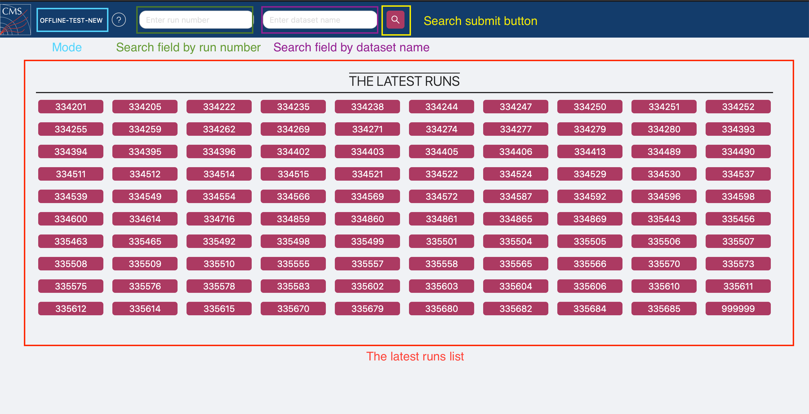
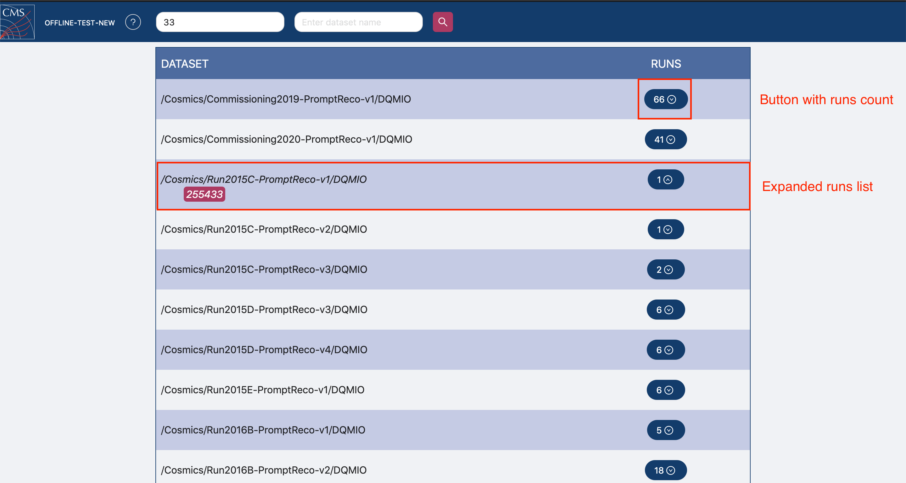
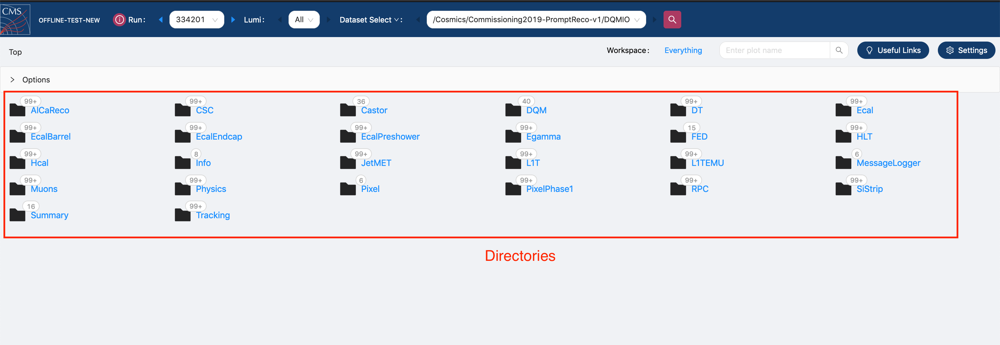
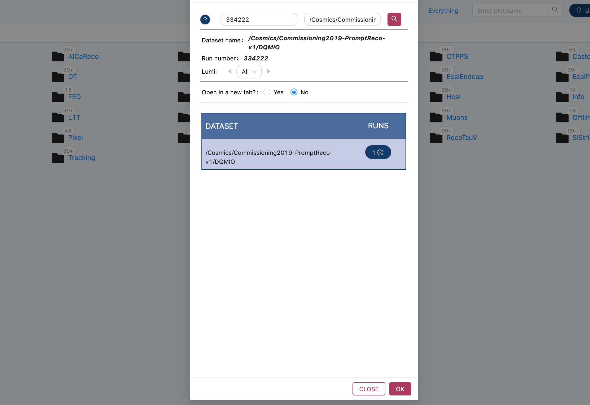
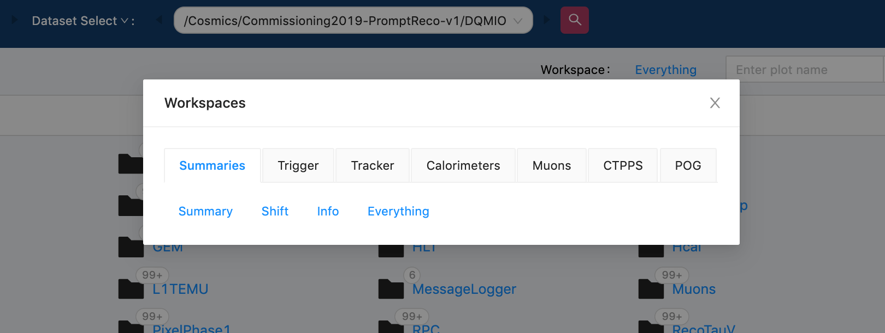
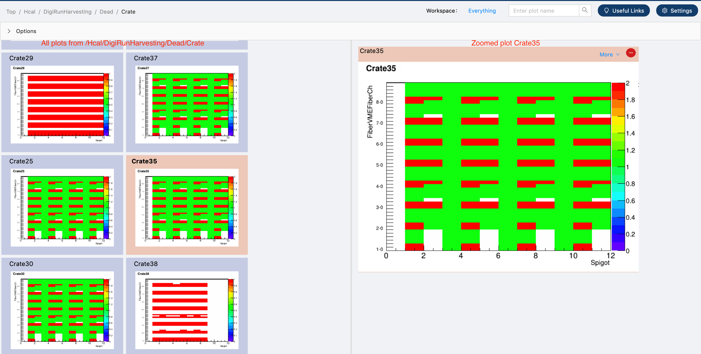
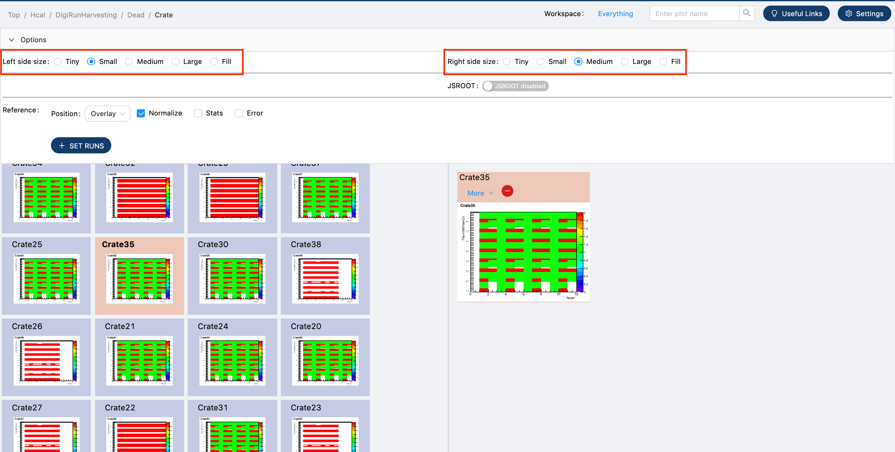
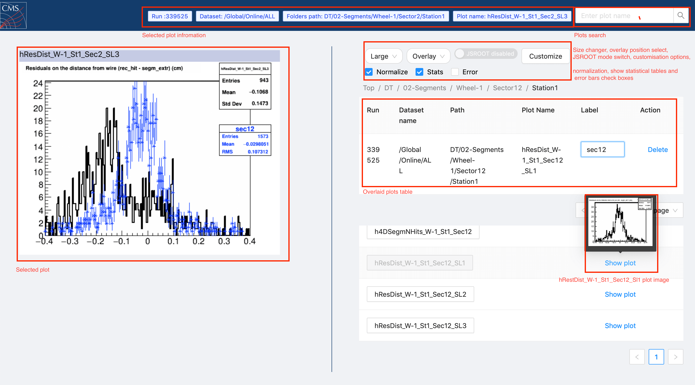
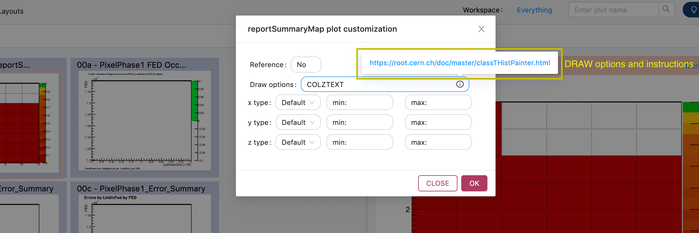

# What is DQM GUI?

DQM GUI is data quality monitoring graphical user interface. It is a web application visualising plots produced by DQM modules. These monitoring elements are important for checking the detector status and quality of data recognition.

## new DQM GUI modes
* Online: https://cmsweb.cern.ch/dqm/online-new/ 

* Online-playback: https://cmsweb.cern.ch/dqm/online-playback-new/

* Offline-test: https://cmsweb-testbed.cern.ch/dqm/offline-test-new/

# Development

## Used technologies
New DQM GUI uses technlogy stack listed bellow:
1. [Next.js](https://nextjs.org/) - React framework
2. [AntDesign](https://nextjs.org/) - Components library
3. [Styled-components](https://styled-components.com/) - for overwriting components style

## Architecture

It is a **statically generated** site, which accesses the backend by using ajax http requests.  In this way we get a deployment advantage- it could be deployed anywhere because it is just js, css and html files.

The same static export is used for all modes (online, offline, in the future for RelVal). Functionalities for offline and online modes are selected by the location where the fontend is stored and by the first request for sample. It means that no need to configure something in addition in order to adapt an export for mode.


## Develop project locally

1. Install Node.js 10.13
2. Clone this project
3. Install all used dependencies: 
```
npm install
```
4. Run project:
```
npm run dev
```

# Get static files of the project

In order to get static files of your loacl project:
```
npm run static_export
```
 Static exported files will be stored in `out/` directory. 

# How to use DQM GUI?

## Home page

### Offline
One home page on new DQM GUI there are 5 main components:
1. Mode - displays DQM GUI mode
2. Search field by run number
3. Search field by dataset name
4. Search submit button
5. The latest runs list, which displays shortcuts of 100 the latest runs 

   

### Online
One home page on new DQM GUI there are 5 main components:
1. Mode - displays DQM GUI mode
2. Search field by run number
4. Search submit button
5. Live mode button, which directs to live mode
5. The latest runs list, which displays shortcuts of 100 the latest runs 

Note: there is no search field by *dataset*, because all data has the same dataset- /Global/Online/ALL

   

## How to make data search?

1. Data search can be done in 4 ways:
   1. By clicking on the run from *The latest runs* list.
   2. By entering run number (full or part of it).
   3. By entering dataset name (full or part of it). **Available just in offline mode**.
   4. By entering dataset name ((full or part of it)) and run number (full or part of it). **Available just in offlin modee**.

2. If data submitted to search...:
   * has no matches, you will see "Results not found message".
   * has at least one match, you will see results table. Results are dividend per dataset. Table has two columns:
      1. Dataset.
      2. Runs. 
         * Button with count, how many runs have dataset, displayed on the same row.
         * Expand runs list by clicking on button with count.
         

3. Select wanted dataset and run.

---

## Browsing through subsystems

When full required set (dataset and run number) is selected, DQM GUI returns directories structure.


1. Every **directory** represents a specific subsystem. In order to see its content, need just click on wanted folder.
2. Current directory is showed on the left side. Every element in the path is inetractive. By electing one of them useer can get back 1, 2 and etc levels back.

3. The number, on the right corner of the folder shows how many monitor elements are in specific folder.

---

## Change run and datesat
 ### Change run
1. Runs select field:
   1. Select a new run number from the **dropdown list**, which is open when you click on a run number's field. Options in dropdown list depend on slected dataset name. It means that all runs in this list have **selected dataset**.

   2. Use **blue arrows**. They let browsing through prev/next run numbers. If a left arrow is grey it means that the current run number is the first in the list of available run numbers, so you cannot go further. The same with a right arrow- it becomes grey when a current run number is the last in the list of available run numbers.

   


 ### Change dataset

1. Select a new dataset name from the **dropdown list**, which is open when you click on a dataset field. Options in dropdown list depend on slected run number. It means that all datasets in this list have **selected run number**.
2. Use **blue arrows**. They let browsing through prev/next dataset names. If a left arrow is grey it means that the current dataset name is the first in the list of available dataset, so you cannot go further. The same with a right arrow- it becomes grey when a current run number is the last in the list of available datasets.


3. Dataset builder

   To turn on dataset builder mode,  need to change the _dataset select mode_ to _dataset builder mode_.
   
   Dataset builder gives an ability to change 3 parts of dataset. Click on the part you want to change and select an option listed in a droptdown. Options is displayed in two colors: red and/or green:
      * If option is red, it is not compatible with the last selected part. The last selected part is writtent in bold and always green. Even thought the option is red, it doesn't mean that it couldn't be selected.
      * If option is green it means that is compatible with the last selected part.

The goal is to get green dataset, combined from 3 parts. 


If at least one part is red, it means that combined dataset doesn't exist.


---

### Change run and dataset with free search
By using select fields mentioned above, users are limited by available options: 
   * All runs listed in dropdown is available just with selected dataset in datasets select field
   * All datasets listed in dropdown is available just with selected run in runs select field

In order to expand search possibilities, we implemented free search.
Free search gives an ability to search by part/full dataset name (just in offline) and/or run number.




When this button is clicked, you will see search dialog. It is divided into 3 sections:
1. Search fields.
2. Selected dataset name and run number (initial values are those, which already selected).
3. Search results.

   In order to change dataset and run number to selected ones, need to click button "OK"  on the right side of dialog. If you want to cancel  changing click "Close".
---

## Workspace

Workspace: folders filter by selected subsystem.


If you want to change workspaces, click on blue word (in this case _"Everything"_),


---

## Plots search


1. Enter full/part of plot name
2. Plot search returns folders, where plot is placed.


3. Go inside wanted folder until the searched plot will be displayed.


---

## Plots

In offline and online archive modes plots are uploaded using lazy loading.
It means, that just plots, which are visible in current window is requested from server.

  .

### Zoom plot
   Click on desired plot.
   Window will be divided in two parts: left and right.
      * Left side has all plots from current directory.
      * Right side has zoomed plots.

   .


### Options

   1. **Change size**
    Sizes can be change on both sides, left and right, separately.
    There are 5 available size options: 

      1. _Tiny_.
      2. _Small_.
      3. _Medium_ (default on the left side)/
      4. _Large_ .
      5. _Fill_ (default on the right side)

   .

   2. **Overlay plot**
      * Overlay plots with the same name, but from different datasets and runs:
      In order to overlay plots:
         1. Click the button "+ Set runs"
         2. Search and select desired run and dataset.
         3. Overlay position can be changed by selecting another option from select field "Position".
         4. Overlaid plot can be normalized by using "Normalize" check box
         5. Overlaid plot can show or hide statistical table by using "Stats" check box
         6. Overlaid plot can show error bars by using "Error" check box

         Maximum 8 plots can be overlaid because of backend reasons.
         In this way all plots will be overlaid.

      * Overlay plots with different names, but from the same dataset and run.
      In this way just one specific plot can be overlaid.
      In order to overlay plots:
      1. Zoom a plot.
      2. Click "More", on the right side of a plot
      3. Click "Overlay with different plot"
      4. New page will be opened. 
   .

   3. **Plots customisation**
      1. Zoom a plot.
      2. Click "More", on the right side of a plot
      3. Click "Customize"
      4. Dialog for plot customization will be opened 
   .


# Known bugs list

1. Check boxes, in the list of overlaid plots, is not working. Those checkboxes should add/remove overlaid plot.
2. Normalize, show error bars, show stats - doesn't affect zoomed plots
3. Already overlaid plots on "overlay plots with different names" crashes, when we want to overlay it with another plot.
4. In the offline test site, when we're trying to make free search, site crashes
5. There is some plots, where api returns error 500 and root adds warning (_adc_per_OnloineBlock_PXForward_)

---

---

## Need to be done

1. Downloading of ROOT files
2. Display server name
3. Integrate P5 alarm manager
4. Change workspaces according mode
5. Alignment workspace for tracker.
6. Tiny url 
7. Updating folders, runs list and plots in live mode every 20 sec. Also sec has to be send to backend.
8. In production on the first load style files are not found (404).
9. Run 338586 shows 404 not found, when it indeed exists (overlay with another plot). Fake Beam Monitor plot for example, is always in ME not found state
10. When trying to change label with special chars (\_) of additional plot, it crashes  (overlay with another plot)
11. Workspace has to have their own plots!
12. Fix code for new offline GUI (layouts, layouts converted and overlay plots with different names is not supported there).

---
